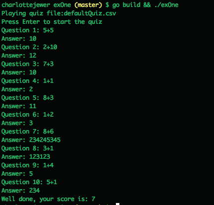

Simple Quiz Program written in go

Start the program with ./exOne

--help will show you optional flags and their uses

You can run with no flags and it will display the defaultQuiz CSV, or you can specify the other quiz in the folder, or use your own if formatted in a csv of question,answer

